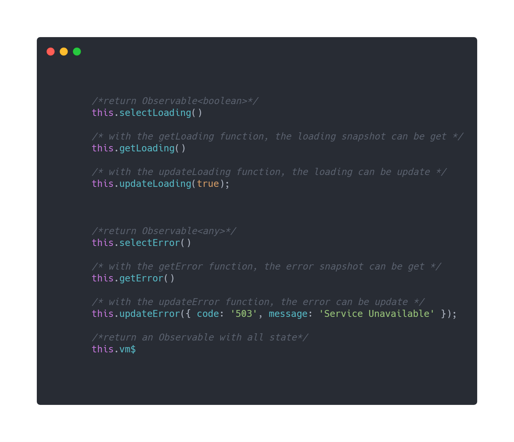
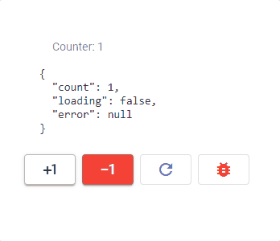
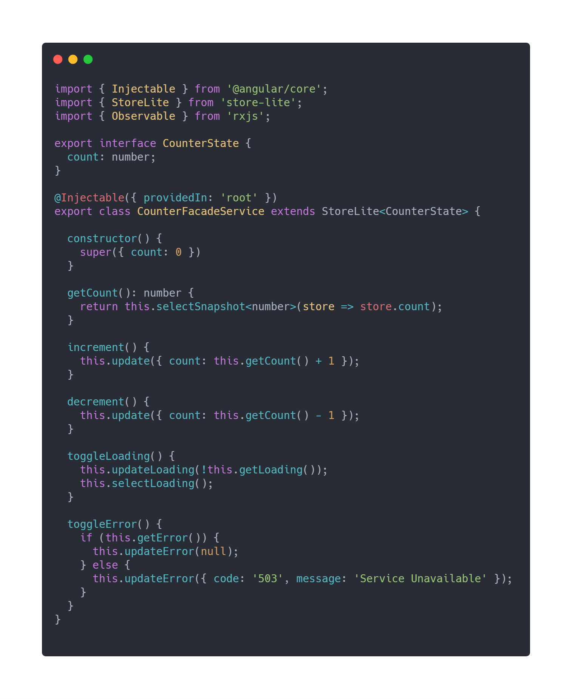
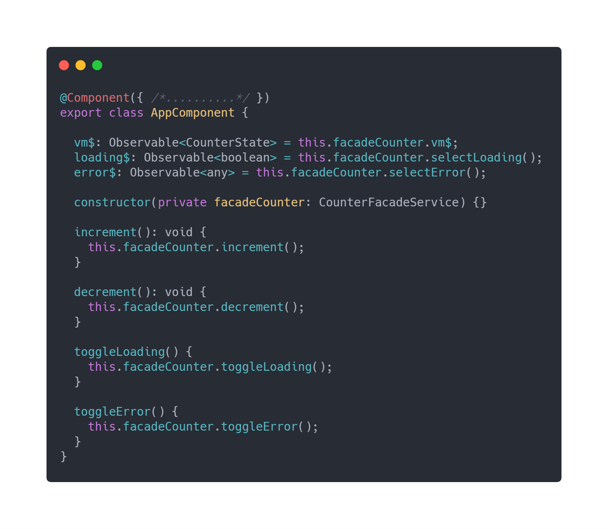
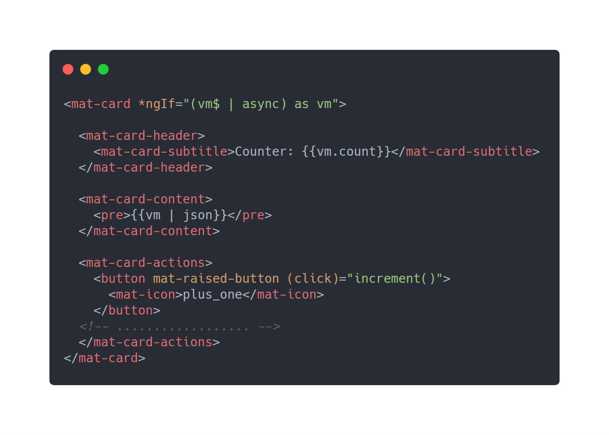

###  Store-lite

This library is just a utility that facilitates the implementation of the Facade + Rxjs pattern.
This pattern was [presented](https://www.youtube.com/watch?v=h-F5uYM69a4&list=PLOETEcp3DkCpimylVKTDe968yNmNIajlR&index=53 "presented") in the ng-conf 2019 by [Thomas Burleson](https://twitter.com/ThomasBurleson "Thomas Burleson") . In addition to other articles such as:
- [View Facades + RxJS!](https://blog.angularindepth.com/angular-you-may-not-need-ngrx-e80546cc56ee "View Facades + RxJS!")
- [Why I stopped using NGRX](https://medium.com/@liorcaspi9/why-i-stopped-using-ngrx-68dfc3cf3be9 "Why I stopped using NGRX")

### How to install?

```
npm i --save @mailok/store-lite
```

### How to use?


######  1.Define your state
```
export interface CounterState {
  count: number;
}

```


######  2.Create your service and inherit from StoreLite
```
@Injectable({
  providedIn: 'root'
})
export class CounterFacadeService extends StoreLite<CounterState> {

  constructor() {
    super({ count: 0 }); //define inital state
  }
}
```

######  3.Obtaining elements of the state as observable
```
@Injectable({
  providedIn: 'root'
})
export class CounterFacadeService extends StoreLite<CounterState> {

count$: Observable<number> = this.select<number>(state => state.count);

}
```

######  4.Obtaining elements of the state as Snapshot
```
@Injectable({
  providedIn: 'root'
})
export class CounterFacadeService extends StoreLite<CounterState> {

getCount(): number {
    return this.selectSnapshot<number>(store => store.count);
  }

}
```

######  5.Update state
```
@Injectable({
  providedIn: 'root'
})
export class CounterFacadeService extends StoreLite<CounterState> {

 increment() {
    this.update({ count: this.getCount() + 1 });
  }

  decrement() {
    this.update({ count: this.getCount() - 1 });
  }

}
```

######  6.Other functions


####  Example









